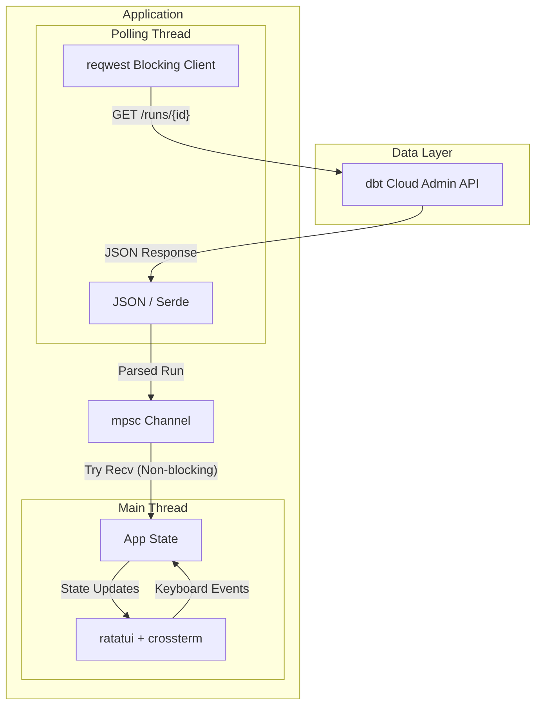

# dbt-ops

**dbt-ops** is a Rust-based CLI and Terminal User Interface (TUI) for operating and monitoring dbt Cloud. It leverages the [dbt Cloud API](https://docs.getdbt.com/dbt-cloud/api-v3?version=2#/) to provide real-time log streaming, run history listing, and administrative insights directly in your terminal.

## Features

- **TUI Log Viewer:** Stream run logs in near real-time with full ANSI color support and 2D scrolling.
- **Run History (`list`):** Instantly fetch your recent dbt Cloud runs, complete with execution times, statuses, and **clickable OSC8 terminal hyperlinks** directly to GitHub Pull Requests.
- **Zero Configuration:** Automatically authenticates using your existing `~/.dbt/dbt_cloud.yml` file.

## Getting Started

### Requirements
1. **A valid dbt Cloud configuration file** located at `~/.dbt/dbt_cloud.yml` (`%USERPROFILE%\.dbt\dbt_cloud.yml` on Windows).
2. The config file should contain your API token and account ID:
   ```yaml
   projects:
     - project-name: "My Project"
       token-value: "dbtu_YOUR_API_TOKEN_HERE"
       account-id: "517"
   ```

### Installation

If you have [Rust and Cargo installed](https://rustup.rs/), you can compile and install `dbt-ops` natively on macOS, Linux, or Windows:

```bash
# Clone the repository
cd dbt-ops

# Install the binary globally to your $PATH
cargo install --path .
```

## Usage

### 1. Listing Runs (`list` or `ls`)
View the most recent dbt Cloud runs in a cleanly formatted table.
```bash
dbt-ops list
```
*Note: If your terminal supports OSC8 (like iTerm2, WezTerm, or VS Code), the `PR` column will contain clickable hyperlinks that open the associated Pull Request in your browser.*

**Options:**
- `-n, --limit <LIMIT>`: Number of runs to fetch (default: 20).
- `-j, --job <JOB_ID>`: Filter runs by a specific Job ID.

### 2. TUI Log Viewer
Attach to a run to view live, streaming logs in a fully interactive Terminal UI.

**Attach to the latest run of a specific job:**
```bash
dbt-ops --job 341099
```

**Attach to a specific Run ID:**
```bash
dbt-ops --run-id 52843050
```

#### TUI Keybindings
- `q` or `Esc`: Quit the application
- `Tab`: Switch between run steps in the left panel
- `↑` / `↓` (or `k` / `j`): Scroll logs vertically
- `←` / `→` (or `h` / `l`): Scroll logs horizontally (pan across long lines)
- `H` or `Home`: Jump to the top of the logs
- `G` or `End`: Jump to the bottom of the logs and resume auto-following
- `r`: Refresh now

## Architecture

The TUI relies on a multi-threaded architecture to ensure the UI remains highly responsive while waiting for network requests.


