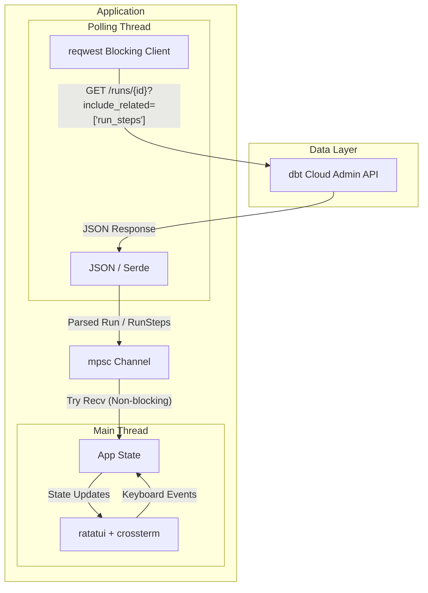

# dbt Cloud Run-Log TUI

A terminal user interface (TUI) written in Rust to monitor dbt Cloud runs in near real-time without needing to use the web UI. It fetches logs directly from the dbt Cloud Admin API and renders them cleanly with ANSI color support.

## Architecture

The application is built using a multi-threaded architecture to ensure the UI remains responsive while waiting for network requests.



- **Polling Thread:** A dedicated background thread wakes up every `interval` seconds (default: 3), uses a blocking `reqwest` client to fetch the latest run data from the dbt Cloud API, parses the JSON payload into Rust structs using `serde`, and pushes the result into an `mpsc` channel.
- **Main Thread:** The primary thread runs a non-blocking `ratatui` event loop at ~10 FPS. Every tick, it checks the `mpsc` channel for new data, updates the `App` state, processes any user keyboard inputs (scrolling, quitting, switching steps), and redrawns the terminal screen.

## Requirements

To use this tool, you must have:
1. **A valid dbt Cloud configuration file** located at `~/.dbt/dbt_cloud.yml`. The application parses this file to extract your API token (`token-value`). 
2. The config file should look similar to this:
   ```yaml
   projects:
     - project-name: "My Project"
       token-value: "dbtu_YOUR_API_TOKEN_HERE"
       account-id: "517"
   ```

## Getting Started

### Installation (From Source)

If you have [Rust and Cargo installed](https://rustup.rs/), you can easily compile and install the binary directly to your system `$PATH`:

```bash
# Clone the repository (or extract the zip)
cd dbt-log-tui

# Install the binary globally
cargo install --path .
```
You can now run `dbt-log-tui` from anywhere on your machine.

### Installation (Pre-compiled Binary)

If you were given a pre-compiled binary for your architecture (e.g., Apple Silicon):
1. Extract the `dbt-log-tui` executable.
2. Move it to a directory on your `$PATH` (e.g., `sudo mv dbt-log-tui /usr/local/bin/`).
3. Ensure it is executable (`chmod +x /usr/local/bin/dbt-log-tui`).

## Usage

Run the TUI without any arguments to automatically connect to the **latest run of the default job**:
```bash
dbt-log-tui
```

If you want to attach to a **specific run ID**, pass it as the first argument:
```bash
dbt-log-tui 52843050
```

### Keybindings
- `q` or `Esc` - Quit the application
- `Tab` / `Shift+Tab` - Switch between run steps in the left panel
- `↑` / `↓` (or `k` / `j`) - Scroll the log output up and down
- `G` or `End` - Jump to the bottom of the logs and resume auto-following
